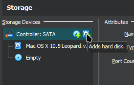
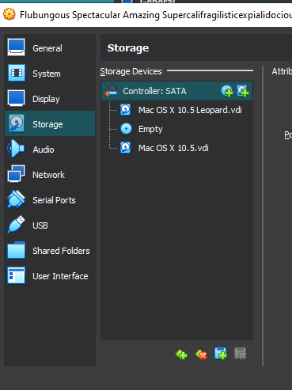

# "AppleIntelCPUPowerManagement" Kernel Panic

  

This is one of the most common kernel panics you can get while running Mac OS X on VirtualBox.

One of two things can cause this:
- the CPU you have told VirtualBox to tell the operating system is either unsupported, doesn't match what it was expecting, or is too new. 
- an update to Mac OS X that is major (i.e Mac OS X 10.6 > Mac OS X 10.7)
- You have an AMD CPU that you did not use a --cpu-profile command to change

To fix this, depends on the cause, and can be fixed in one of two ways:
1. Make sure the CPU you have told VirtualBox to use, through VBoxManage, is supported by whatever Mac OS X version you are using, and that it is not too new.
2. If the above doesn't work, you may need to completely get rid of AppleIntelCPUPowerManagement.kext.

## Solution 1

1. Firstly, try these commands one at a time, seeing if it boots with each one:
- `VBoxManage modifyvm "VM Name" --cpu-profile "Intel Core2 T7600 2.33GHz"`
- `VBoxManage modifyvm "VM Name" --cpu-profile "Intel Core i7-2635QM"`
- `VBoxManage modifyvm "VM Name" --cpu-profile "Intel Core2 X6800 2.93GHz"`

If none of these work, and still return the same kernel panic, and you have recently performed a major upgrade, you will have to do something more complicated.
This requires:
- Another install of Mac OS X on another virtual machine that can boot
- The hard drive of the virtual machine that fails to work to be in a format that can be recognised by VirtualBox/whatever other software

To fix it, follow these steps:

1. In VirtualBox, go to the other virtual machine with a working Mac OS X install, and open `Settings` for that machine.
2. On the `Storage` tab, add another hard disk by pressing the little hard drive icon next to `Controller: SATA`

  

3. Choose the disk image of the non-working virtual machine, and hit `OK`

  

4. Start the virtual machine, and boot into Mac OS X.
5. With the new hard drive attached, you should have your other hard disk on the desktop, double click it to open Finder.
6. Navigate to /System/Library/Extensions and delete the two files with `AppleIntelCPUPowerManagement.kext`
7. Shut down Mac OS X, detach the hard drive and attempt to boot the non-working virtual machine again.
8. You should be able to reboot into Mac OS X now!

#### Thanks for reading!
