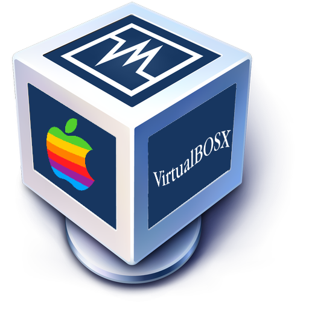

 
  <h1> This document is a fork of the original DarwinKVM! Check them out at https://github.com/royalgraphx/DarwinKVM <3 </h1>

<h2 align="center">What is this for?</h2>

<h5 align="center">This repository is (hopefully) a work-in-progress guide of attempting to get older versions of Mac OS X running in VirtualBox (eventually VMWare, who knows when I will write a guide for that). Keep in mind they won't be the best, and certainly later OSX versions.. will not perform the best. From my testing, 10.5 and below seem to work quite well, however 10.6+ may be a bit slower. Of course, if you want to seriously use these, be my *guest*, however I'll just give you a pat on the back for the resillience you have for using such a.. good! operating system as your "daily driver". If you're looking for some more serious stuff, check out DarwinKVM @ https://github.com/royalgraphx/DarwinKVM (however, as of now, it is only Linux based, so have fun trying to do stuff like that on Windows).  </h5>

<h2 align="center">Who is this for?</h2>

<h5 align="center">This is for <s> experienced </s> beginner users, believe it or not!! There is no Discord or dedicated support (though, if you really want help, my Discord is @koltontheshek). Hopefully you'll be fine. It'll be okay. Maybe theres some big boy words, but you can get through. And hopefully it works. Hopefully. You'll want the following things installed:</h5>

1. [**VirtualBox**](https://en.wikipedia.org/wiki/Linux)
   - The latest version of VirtualBox (7.0+ will <i> probably </i> do.

2. A valid Mac OS X 10.4+ Install DVD, in .iso format (no, your InstallMacOSX.dmg will not work, sadly) 
   - Google is your best friend. I can't, and won't, provide download links on where to get said .iso's.

3. [**Atleast the tiniest bit of cmd knowledge**](https://learn.microsoft.com/en-us/windows-server/administration/windows-commands/windows-commands)
  - Atleast know how to `cd` to places, as you'll probably need to. This, also, if it wasn't obvious (it probably wasn't, to be fair) is aimed at Windows users, I doubt this process on macOS is much different. Or Linux. Nerds. 

4. Paaaaatience!
  - Do remember, you are running Mac OS X on unofficial hardware, and through a hypervisor (That being VirtualBox), so things will not work every time! 

<h5 align="center"><b>PLEASE READ CAREFULLY</b>.</h5>

<h5 align="center">Make sure anything you may copy and paste and/or follow in this guide is followed to the exact letter! VirtualBox can be very finnicky with Mac OS X and likely, if you don't, you'll be scratching your head on "why no work?" </h5>

<h2 align="center">You can now proceed to the <a href="../02-Install/00-GettingVirtualbox">Install</a> section!</h2>
