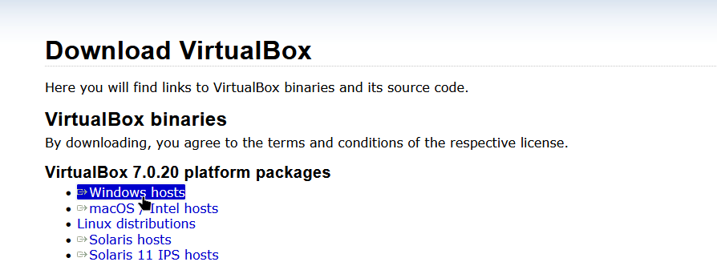

<p align="center">
  
</p>

# Downloading VirtualBox
#### Making sure users get the latest version

<br>
To get started with VirtualBOSX, you'll obviously need to download VirtualBox from the website. It's pretty simple. As of writing, the latest version is 7.0.20. 

```bash
https://download.virtualbox.org/virtualbox/7.0.20/VirtualBox-7.0.20-163906-Win.exe
```

This hopefully shouldn't take long. Afterwards, just click the file and you'll launch the VirtualBox installer.

<p align="center">
	
</p>

Very simple. Just keep clicking Next until the installer starts (and finishes), that was so easy, wasn't it?

<h2 align="center">If that was easy enough, you can now go to the <a href="01-VBIntroduce">Introducing VirtualBox</a> section</h2>
