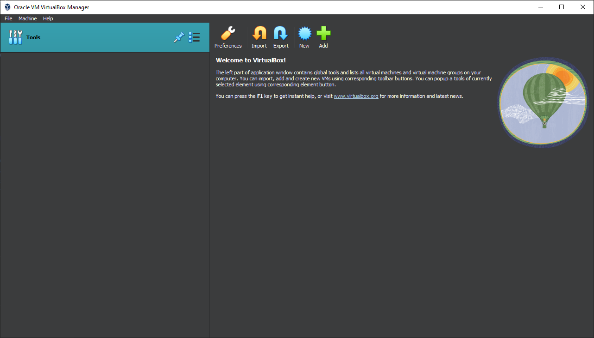

# The VirtualBox User Interface
#### Same across all OS's, really. And quite simple.

  

Hopefully the UI doesn't scare you. Did it? I hope it didn't. Anyways, it's quite simple. You have a "New" button, believe it or not, this creates a new virtual machine. Nice, isn't it?
The other buttons, such as Import/Export and Add are quite useless to us (unless you've already made a virtual machine and somehow managed to remove it)

You've also got a nice hot air balloon. They took the tux away. I will never forgive them.

Need I say more? Hopefully that should be a nice introduction. Explore on your own. Tinker settings that don't look scary. Don't use VirtualBox to detonate bombs, please. 

<h2 align="center">What a short introduction. Anyways, onto the <a href="02-Creation">Creating the Virtual Machine</a> section!</h2>
