# Creating the Goddamn Virtual Machine
#### Gaming

{: .warning }
No, creating a Mac OS X Puma virtual machine with 8GB RAM will not let you run Halo any better. Stick to limits of what would be the "norm" of the time, for example since Puma was released in 2001, 256MB of memory would be a good starting point. Also, earlier versions of Mac OS X don't behave well with more than 1 core (aka, Kernel Panic Central)

# Pressing Buttons and Stuff.

At the main screen we shown you before, hit the `New` button, and depending on whether you want gamer mode or just regular, we're gonna just be using Guided Mode.
Right now, it should default to a nameless, no-iso x64 Windows 10 virtual machine. Give it a nice name! Or, well, atleast something you won't regret typing out later. Calling it "Flubungous Spectacular Amazing Supercalifragilisticexpialidocious Mac OS X Virtual Machine!" will make you realise your <s> amazing </s> horrible, life choices. Feel free to name it that <i> after </i> everything is installed though.

  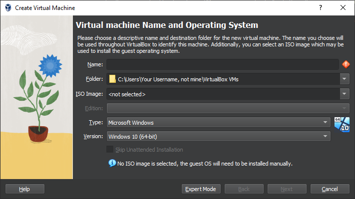

# Pressing Buttons Pt. 2 Electric Boogaloo

Under `Folder`, choose a place where you want to store your illegal operations. 
For ISO Image, if you've already got a Mac OS X .iso, select that. It'll tell you it can't determine what OS it is from that, probably. Atleast it did for me. VirtualBox is a bit slow, please excuse it. 

Use your favourite mouse pointer and go over to the `Type`, and change it to `Mac OS X`. Under version, this is pretty dependant on the version you would like to use. Here's a fancy table I pulled from, I won't say where, I'm quirky like that, but somewhere nice to let you know what to choose.

| Mac OS X Version | VirtualBox Version |
| ---- | ---- |
| Mac OS X 10.4 - Mac OS X 10.5| Mac OS X (64-Bit) |
| Mac OS X 10.6+ | The Corresponding Version |
| Mac OS X 10.4 (PPC) | VirtualBox doesn't support PowerPC, take a look at qemu-ppc instead. |

Please clap. This table took me a whole 2 seconds of writing to produce. If this is somehow confusing, I don't know. Skill issue tbh.

Once you're done, you should have a very nice, completed result. For this example, maybe I said this a bit late, I'll be using Mac OS X 10.5 (Leopard) because that's the only image I had on hand.

  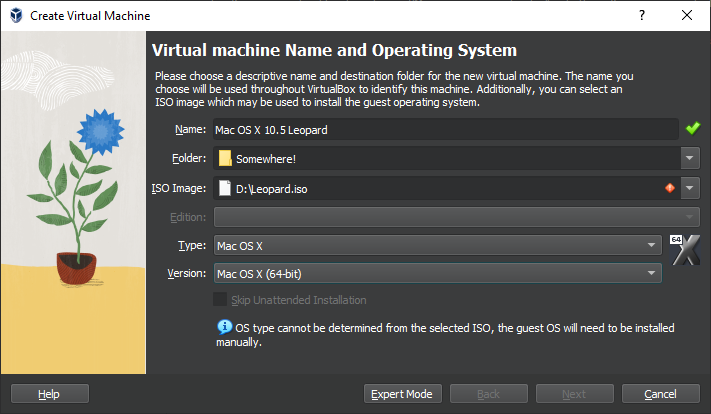

Now you can hit `Next` and be greeted with a RAM/Processors slider. Don't be autistic, like me, and start sliding them up and down. Or do, actually, it's pretty fun.

  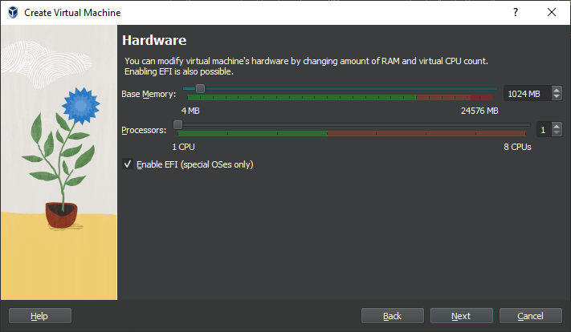

I'll be simple and go with a 1GB/1 Processor combo. 

Keep the goddamn EFI checkbox checked. I think. Yeah, actually, you do. Keep that checked. You'll need it. 

Hit `Next`. You're probably getting good at this. I applaud you.

This is where you can select your hard drive space. I'm going with 20GB. It's the default, and frankly, I'm gonna use like, 2GB of that. Infact, 10-15GB is probably the bare minimum space you'll need. Go for 500GB if you really want. Your hard drive space.
If you HATE expanding things, tick the `Pre-allocate Full Size`, which will just make it whatever size you selected that instantly instead of dynamically expanding the size of it as you use it. I'm not though. My precious 5GB.

  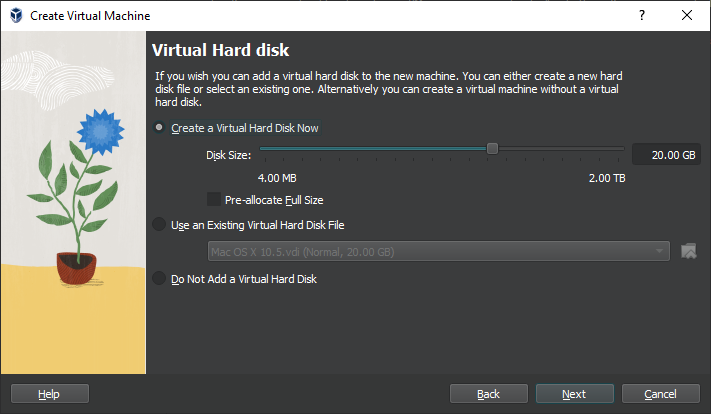

Now you'll get a summary. Check everything over you normie. I'm sure you got it all right. Just hit `Finish` when you're ready to be greeted to a new virtual machine.

# We Aren't Pressing Buttons Anymore, But It's Certainly Button Pressing.

Congratulations, whoever you are! You made it through the first part of your illegal business. I applaud you. I'm not responsible for anything you may do, whether that is start conflict between people on X (formerly Twitter) or do something that will make you look like a proper malaka.

  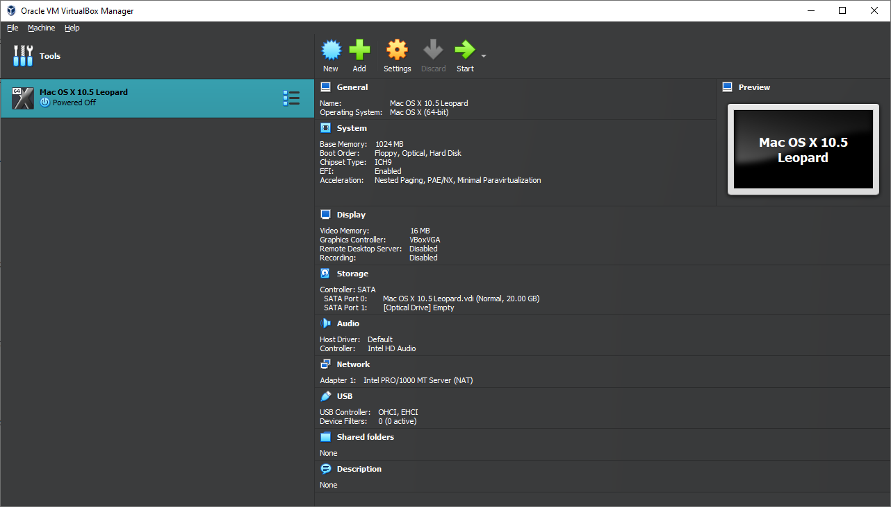

Anyways, if you pressed `Finish` and not Cancel, or hit the big power button on your computer, you'll be very nicely greeted with an overview of your amazing virtual machine. Not for long, though, Hit Dat Fukkin `Settings` button.

  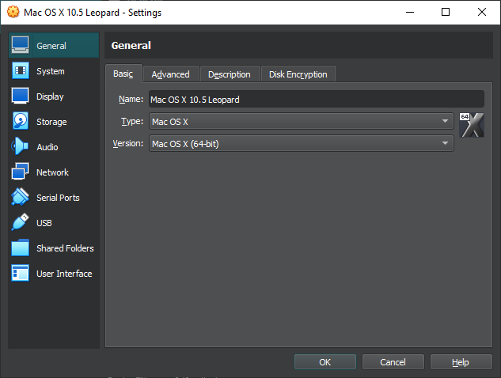

Okay, we're in the mainframe. Put on your gamer goggles, not the second pair though, those are for later. Just put them on. You'll be on the `General` page, and you'll see your amazing name you set and the version. Nothing here that is noteworthy. Let's go onto the `System` tab.

  

If you didn't assign 2 terrabytes of memory to your virtual machine, you'll see a nice slider that dictates, not like certain world leaders, how much memory you assigned. I lied, by the way. We don't need to be here for now. Actually, we do. Uncheck `Floppy` and move `Optical` and `Hard Disk` up one. A final result should look like this:

  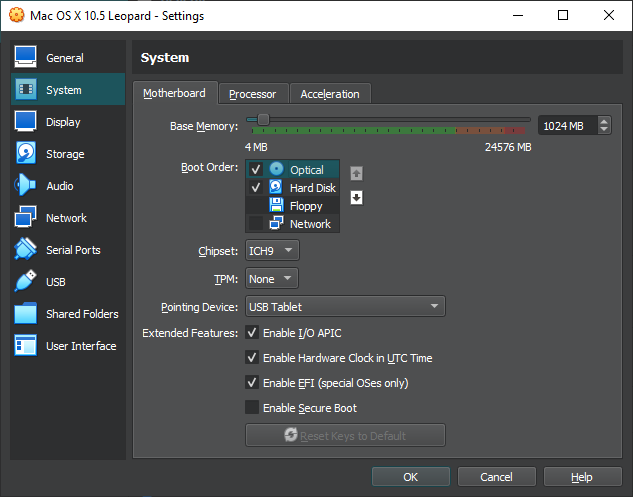

Okay, now we're done gaming on this part, head over to the `Display` section. Crank that `Video Memory` slider up to 128MB ram, which is the maximum we can set, sadly, and check the `Enable 3D Acceleration` checkbox.

 

  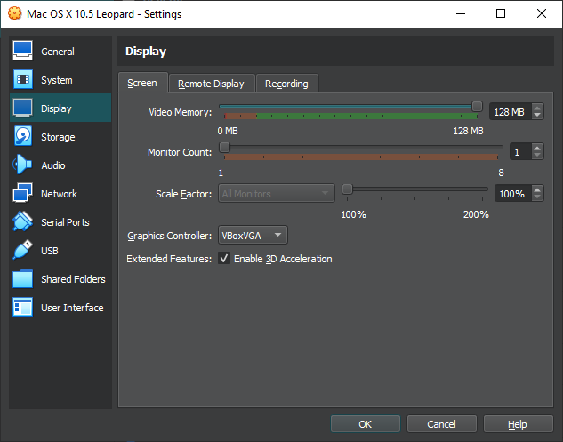

More changing of tabs. You've got 2 choices here:

- If you didn't give the machine an ISO image at the start, read this
- If you did, skip over this.

## Giving That Thing An ISO Image So It Doesn't Just Fail To Boot.

Head over to that `Storage` tab, and click the little disc icon with the `Empty` text. Not for long, though.
On the right, you'll see a nice `Attributes` section, and just below that, a text with an `Optical Drive: SATA Port 1`. Next to that, there should be a teensy little disc icon. Well, it's like 2% smaller than the one you clicked before. Anyways, hit that, and then click "Choose a disk file...". Find the ISO image you legally obtained and double click it. Wasn't that easy?

 

  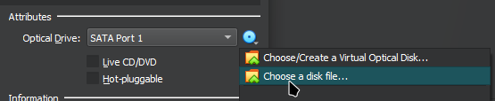

## More settings to change

We're pulling out the big boy tables again. Click the `USB` tab, and you'll be greeted with 3 radio things. I'm not a pro UI designer. 

| Mac OS X Version | USB Type |
| ---- | ---- |
| Mac OS X 10.2.7 and Prior | USB 1.1 (OHCI) |
| Mac OS X 10.2.7 - Mac OS X 10.7.3 | USB 2.0 (OHCI + EHCI) |
| Mac OS X 10.7.3+ | USB 3.0 (xHCI) |

After you've selected the USB version, just hit `OK`. You'll be jumped back to the overview with your upgraded gamer machine.

{: .warning }
If Mac OS X ends up not liking your keyboard and mouse for whatever reason, and decides to not see it (and gives the "please connect a keyboard" screen), you may have to reboot the machine once or twice, and making sure you have hit the Host key (normally Right Ctrl). If it ends up not working after multiple reboots, go down a USB type. If you're at USB 1.1 and it still refuses to work, you will just have to keep rebooting until it does. We love VirtualBox! 

# Time To Game Part Two

Close VirtualBox. We're gonna game now.

Once VirtualBox is closed, hit Win + R to open up the Run dialog, and type in `cmd`. Afterwards, press `Ctrl+Shift+Enter` to run as administrator.

 

  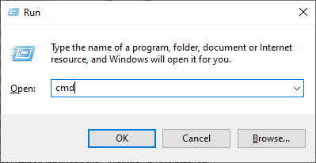

With command prompt open, `cd` to the directory you installed VirtualBox to. Normally, if you didn't change it, this will be `C:\Program Files\Oracle\VirtualBox`

In the directory, you'll want to execute a few commands. However, we're pulling out the table(s) again. Yeah, we're going full table slam mode.

But, these commands `should` be global, run these first before the tables.

`VBoxManage.exe modifyvm "VM Name" --cpuidset 00000001 000106e5 00100800 0098e3fd bfebfbff`
`VBoxManage setextradata "VM Name" "VBoxInternal/Devices/efi/0/Config/DmiSystemVersion" "1.0"`
`VBoxManage setextradata "VM Name" "VBoxInternal/Devices/smc/0/Config/DeviceKey" "ourhardworkbythesewordsguardedpleasedontsteal(c)AppleComputerInc"`

Obviously, replace "VM Name" with your virtual machine name.

Anyways, table time. This is the more specifics.

| Mac OS X Version | Command To Run |
| ---- | ---- |
| Mac OS X 10.4 - 10.6 | `VBoxManage setextradata "VM Name" "VBoxInternal/Devices/efi/0/Config/DmiSystemProduct" "iMac4,1"` |
| Mac OS X 10.6 - Mac OS X 10.13 | `VBoxManage setextradata "VM Name" "VBoxInternal/Devices/efi/0/Config/DmiSystemProduct" "MacBook8,2"` |

One more table. I swear.

| Mac OS X Version | Command To Run |
| ---- | ---- |
| Mac OS X 10.4 - 10.6 | `VBoxManage setextradata "VM Name" "VBoxInternal/Devices/efi/0/Config/DmiBoardProduct" "Mac-AA95B1DDAB278B95"` |
| Mac OS X 10.6 - Mac OS X 10.13 | `VBoxManage setextradata "VM Name" "VBoxInternal/Devices/efi/0/Config/DmiBoardProduct" "Mac-F305150B0C7DEEEF"` |  

You should be Gamer to Go after these commands. Just kidding. One more table.

| Mac OS X Version | Command To Run |
| ---- | ---- |
| Mac OS X 10.4 - 10.6 | `VBoxManage modifyvm "VM Name" --cpu-profile "Intel Core2 T7600 2.33GHz"` |
| Mac OS X 10.6 - Mac OS X 10.13 | `VBoxManage modifyvm "VM Name" --cpu-profile "Intel Core i7-2635QM"` |

Yayy! Okay, that was THE last table. Last table ever, actually. Good luck seeing a table again.

 

  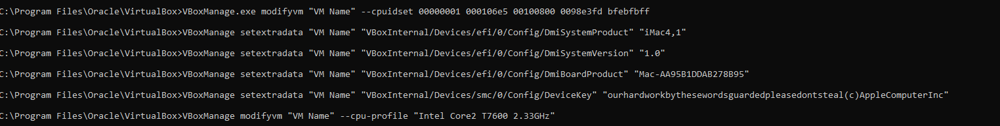

## After doing the commands, continue onto the <a href="03-Installing">Installation</a> section!
