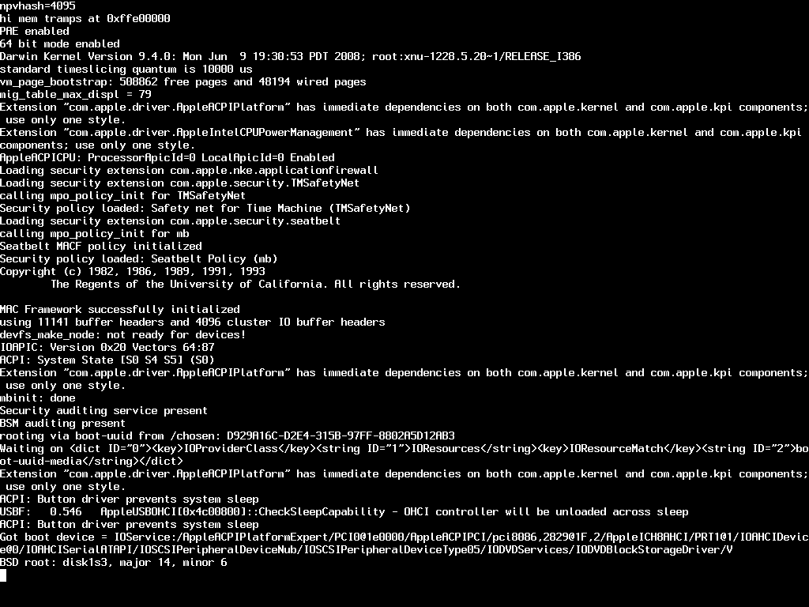
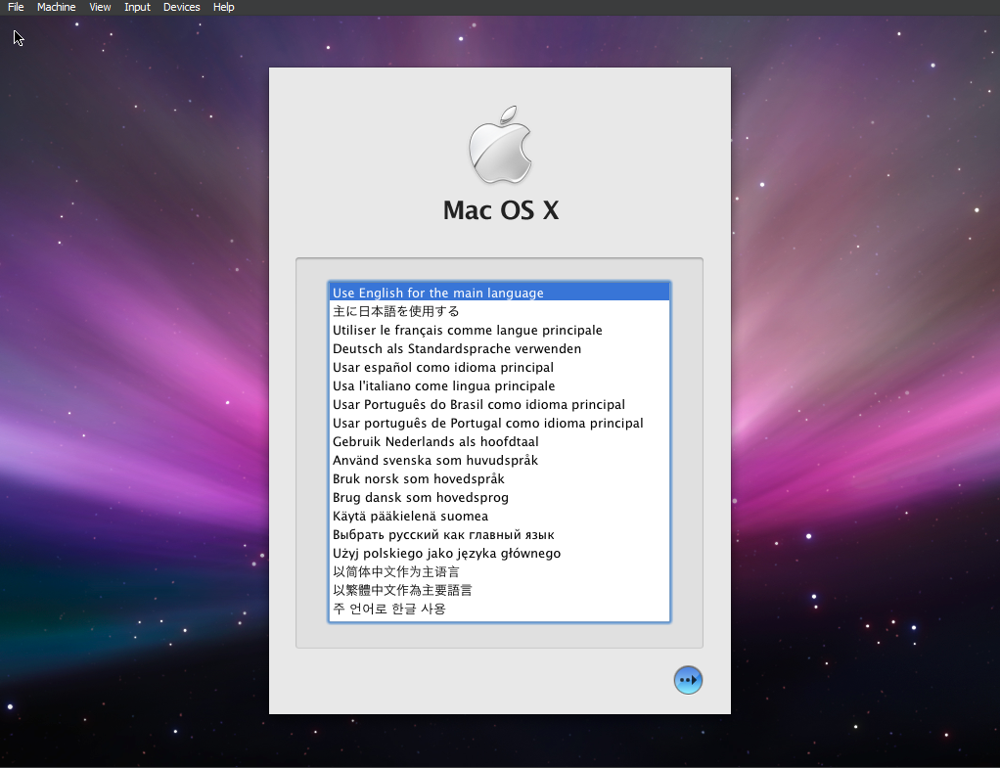
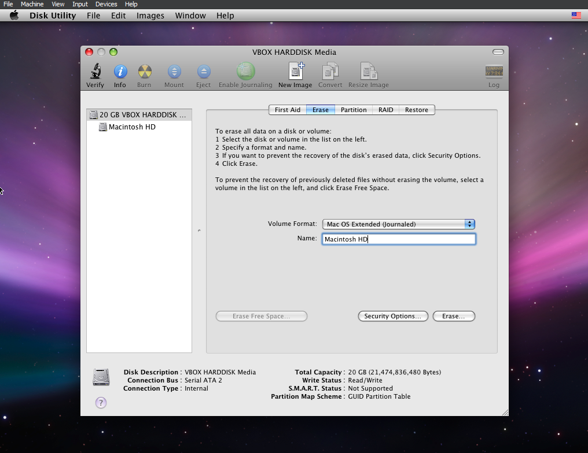
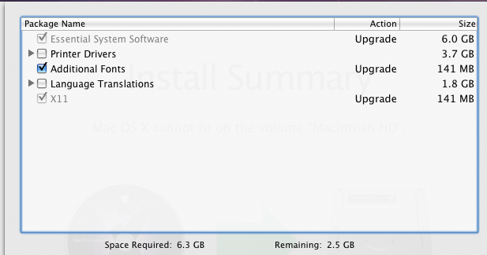
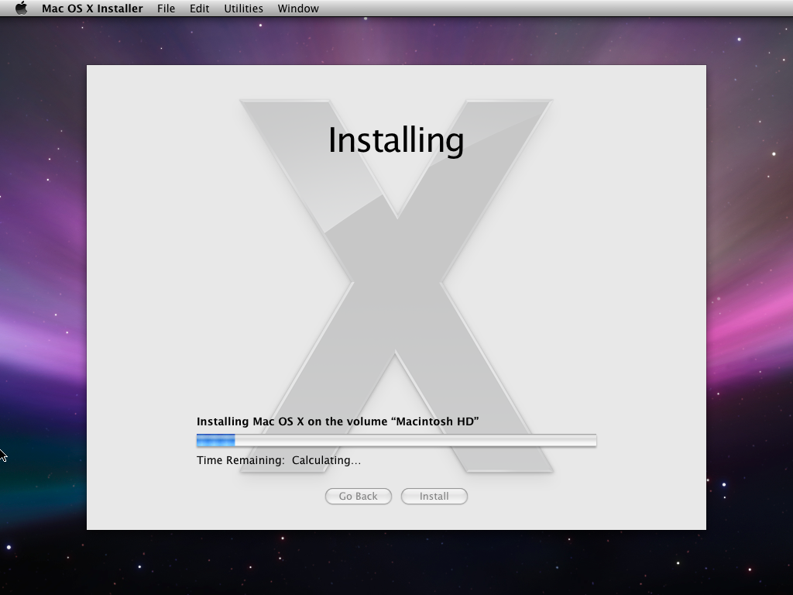
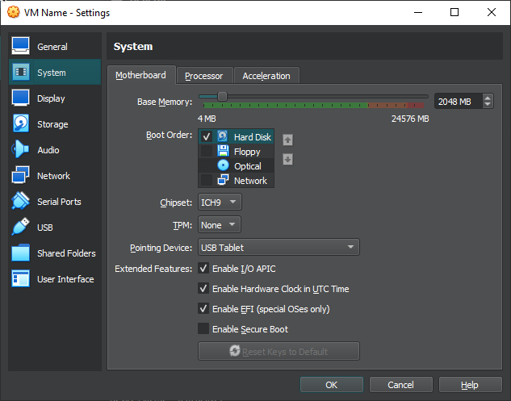
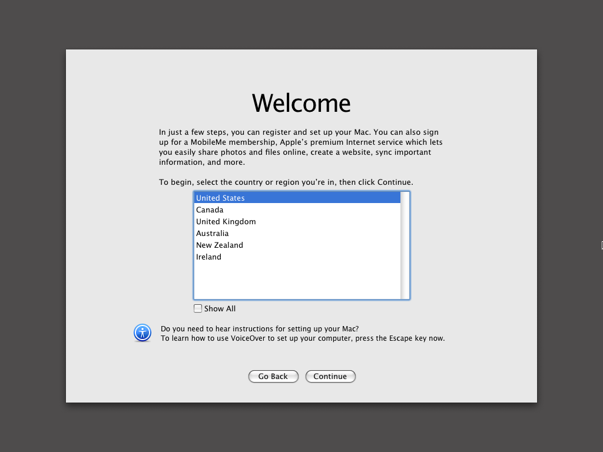
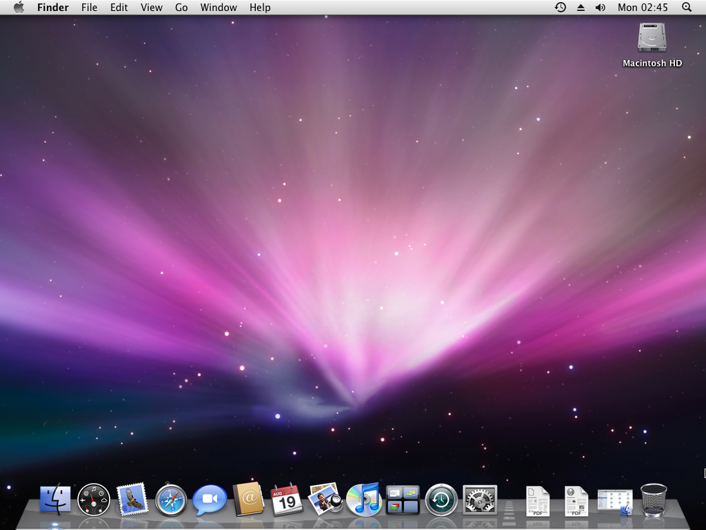

# Gaming Part Three

Okay, you can close the gamer prompt now. Launch VirtualBox once again, and with the virtual machine you just modified, with the disc inserted, you are good to game.
Hit `Start`, and pray to God what you just did doesn't cause a mass genocide.

 

  

Good, hopefully you should see this too. This is verbose booting Mac OS X, and as long as it isn't frozen on some text with lots of codes that you don't understand, you should be good to go, and shortly soonafter you should be in the installer!
If you do see exactly that, that is something that you should consider seeing a doctor for. No, seriously, if you do, head over to the <a href="../../writeups/01-KernelPanics/index.md">Troubleshooting</a> section.. God help us all.
 

  

Select your language, hit the right arrow, and at the top go to `Utilities` and then `Disk Utility`
 

  

Now, on here, go to the `Erase` tab, and choose a nice name. I'm basic, going with the old Macintosh HD. Leave it at "Mac OS Extended (Journaled) and then hit "Erase..."

After that is done, exit out and hit `Continue` on the screen. Agree to the Terms and Conditions you totally are following, right? Don't make me tell Tim Apple. Anyways, select your disk and then `Continue` once again.

Before you go ahead and `Install`, hit `Customise`, and deselect `Printer Drivers` and `Language Translations`, frankly they take up a lot of unneeded space and you don't have a printer that would likely want anything to do with such an old OS.

 

  

Hit `Install`, let it validate your image, and boom! You're now installing Mac OS X onto your virtual machine. 

  

It shouldn't take too long at all.

After it installs, shut down the virtual machine, and head to `Settings` again. Make sure `Hard Disk` is set to the top priority and `Optical` is unchecked. Hit `OK` and start the virtual machine again.

  

Now, hopefully, you'll boot right into the setup! No intro video, sadly, you'll still hear the music though! Probably due to graphics or something, but anyways,
you may get a message stating the keyboard cannot be identified. Just click "OK" and follow what it says. 

  

Just go through the setup as usual, and skip the registration and Apple ID questions. If, you successfully managed to do it, congrats! You'll be introduced to a familiar desktop.

  

Again, congratulations! If you didn't have any problems, you should be good to go. Unless you're on OSX 10.7+, you won't have VirtualBox Guest Additions. If you are, however, and you would like those, at the Menu Bar, click `Devices`, and then `Insert Guest Additions CD Image...`. With that inserted, head to the CD directory and double click `VBoxDarwinAdditions.pkg`, and follow the installer questions.

